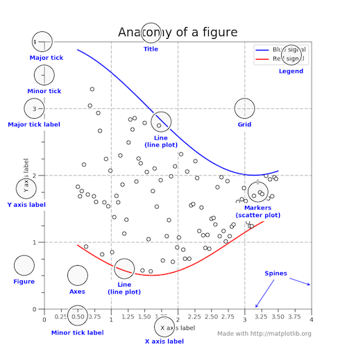
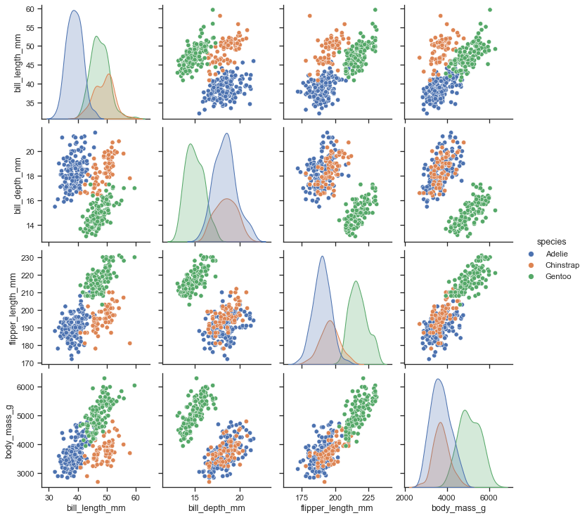
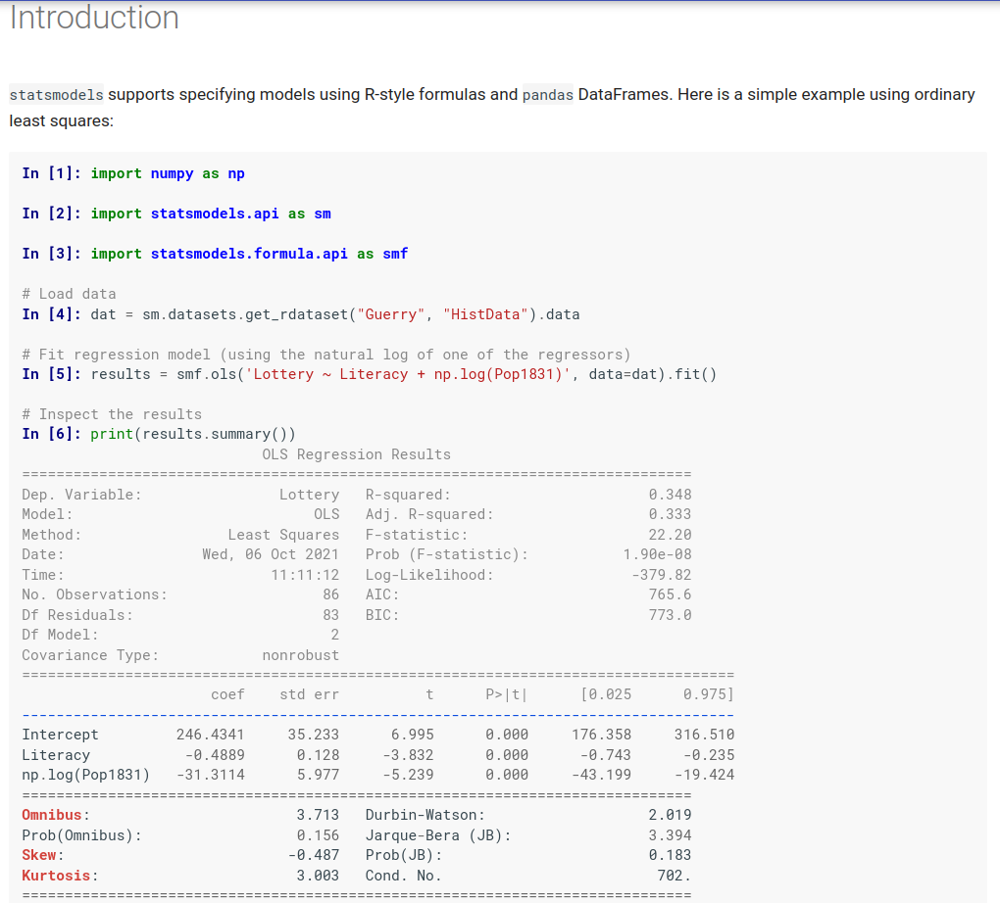
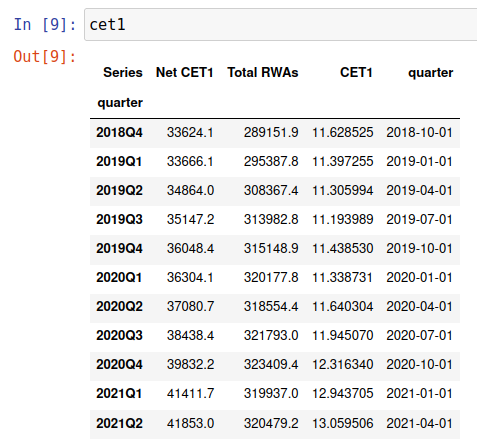
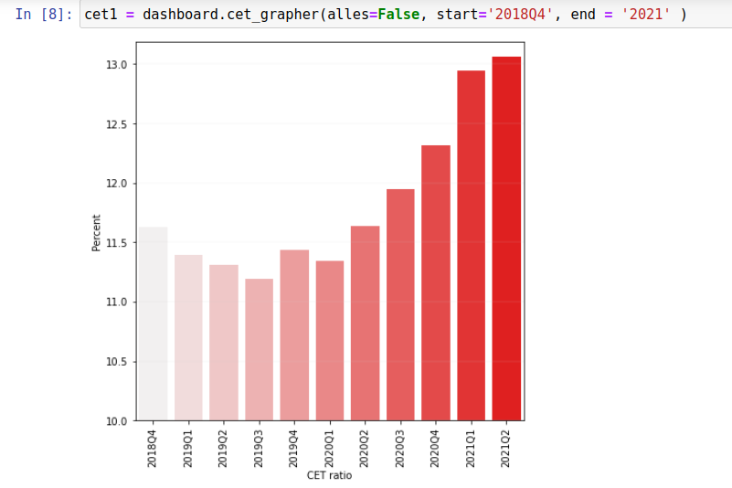

## All the things you can do with Python 

The value-added Python offers over and above alternative packages.

### [Martien Lubberink](https://people.wgtn.ac.nz/martien.lubberink/professional)

EAA - ARC Python Primer for Accounting Research

---
## Python 

+ [Python](https://en.wikipedia.org/wiki/Python_(programming_language)) is an interpreted high-level general-purpose programming language. 
+ Python was conceived in the late 1980s by Guido van Rossum.
+ The latest version is Python [3.10.0](https://www.python.org/downloads/). 
+ We will rely on Python version 3.8 via [Anaconda](https://www.anaconda.com/products/individual). 

---
## Why Python?


---
## Why Python?
+ Versatility - wide range of applications
  + Speeds up learning 


------
## Why Python?
+ Code readability and code maintenance
  + [Jupyter](https://jupyter.org/) notebooks: 


---
## Why Python?
+ [Popularity](https://statisticstimes.com/tech/top-computer-languages.php) and support, e.g. via [Stackoverflow](https://stackoverflow.com/)
+ Wealth of libraries 
  + [Pandas and Numpy](https://www.scipy.org/) for data analytics
  + [Scikit-learn](https://scikit-learn.org/stable/index.html) and [TensorFlow](https://www.tensorflow.org/) for ML.
  + [Geopandas](https://geopandas.org/) and  [xarray](https://xarray.pydata.org/en/stable/index.html) for geospatial data. 
  + [WRDS](https://pypi.org/project/wrds/) and [Eikon](https://pypi.org/project/eikon/) for access to WRDS & Eikon
  + [pandaSDMX](https://pandasdmx.readthedocs.io/en/v1.0/index.html) for access to the ECB statistical warehouse.


---
## Why Python?

+ Collaboration:
  + [Github](https://www.github.come/)
  + [Colaboratory](https://colab.research.google.com)
  + [Datalore](https://datalore.jetbrains.com//?utm_source=anaconda.com&utm_medium=cpc&utm_campaign=anaconda-navigator-2020&utm_term=&utm_content=&=)


  
---

## Why Python?

+ Python input from most popular file formats:
  + Excel
  + csv
  + SAS 
  + Stata
  + json
+ Or directly from sources, such as HTML and via APIs

---

## Why Python?

+ Python output:
  + Tabular materials to Excel, csv, [LaTeX](https://www.latex-project.org/).
  + Graphs, eg. with [Matplotlib](https://matplotlib.org/stable/gallery/showcase/anatomy.html?highlight=anatomy%20py):   



---
## Why Python?

+ Python output:
  + Tabular materials to Excel, CVS, [LaTeX](https://www.latex-project.org/).
  + Graphs, eg. with [Seaborn](https://seaborn.pydata.org/index.html)



---
## Python and Data Analysis

+ Data analysis:
  + [Statsmodels](https://www.statsmodels.org/stable/index.html)
  + [Linearmodels](https://bashtage.github.io/linearmodels/panel/examples/examples.html)
  + [Stata integration](https://www.stata.com/new-in-stata/jupyter-notebooks/)



---

## But most importantly:
+  Python can support your research.
  + Some examples of some cool research that uses Python:
    1. [Web Scraping Housing Prices in Real-time: the Covid-19 Crisis in the UK](https://papers.ssrn.com/sol3/papers.cfm?abstract_id=3916196)
    2. [Central Bank Communication with Non-Experts: A Road to Nowhere?](https://papers.ssrn.com/sol3/papers.cfm?abstract_id=3936235)

---

## Example: resampling data

+ An example of superior date handling capabilities of Python and Pandas
+ We often need to resample data: e.g. from monthly to quarterly, from quarterly to annually. See below data from the [RBNZ](https://bankdashboard.rbnz.govt.nz/summary):



---

## Example: resampling data

+ An example of superior date handling capabilities of Python and Pandas
+ We often need to resample data: e.g. from monthly to quarterly, from quarterly to annually. See below data from the [RBNZ](https://bankdashboard.rbnz.govt.nz/summary):



---

## Example: resampling data

+ An example of superior date handling capabilities of Python and Pandas
  + We often need to resample data: e.g. from monthly to quarterly, from quarterly to annually.
+ Code:
```python
cet1_res = cet1[['Net CET1', 'Total RWAs', 'CET1']]
cet1_res = cet1_res.resample('A-JUN').last()
```

---

## Example: resampling data

```python
print(cet1_res.to_markdown())
```
|    |   Net CET1 |   Total RWAs |    CET1 |
|:----------|-----------:|-------------:|--------:|
| 2019      |    34864   |       308367 | 11.306  |
| 2020      |    37080 |       318554 | 11.640 |
| 2021      |    41853   |       320479 | 13.059 |

---


